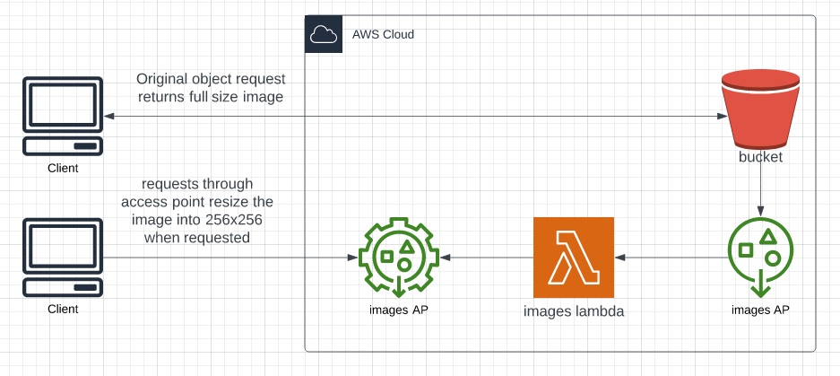

Thumbnail generator

Required:
	- AWS Role with IAM permissions to create infrastructure

Image thumbnail generator.

Images are stored full size in S3 bucket.

when requested from S3 bucket they will return full size.

When requested from the Access Point it will kick off the images lambda.

This lambda will use the pre-signed link from the request download the file and transform it to 256x256 and return the requested images

terraform - contains terraform to create the infrastructure required 

